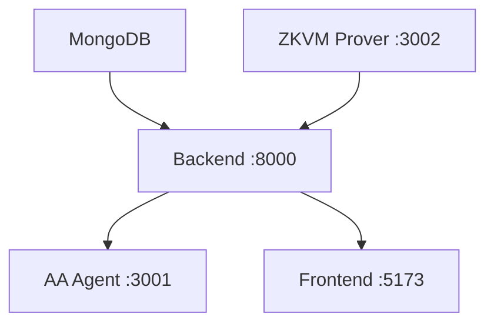
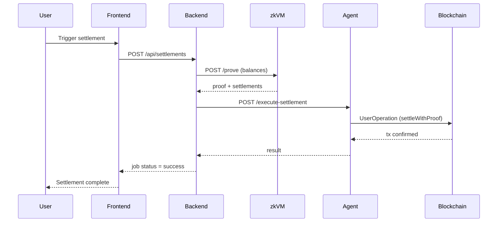

# SplitWiser

SplitWiser is a trust-minimized group expense settlement system built on top of RISC Zero zkVM and ERC-4337 Account Abstraction.

The core idea: traditional apps like Splitwise require you to trust the backend's math. SplitWiser replaces that trust with a cryptographic proof — the settlement is executed inside a zkVM, proven correct, and submitted on-chain in a single gasless transaction.

---

## How It Works

1. Users create a group and add expenses via the frontend.
2. The backend computes each participant's net balance.
3. Those balances are passed as input to the RISC Zero zkVM, which runs the debt-simplification algorithm and produces a **receipt** — a cryptographic proof that the output is correct.
4. The proof and settlement plan are forwarded to the AA Execution Agent.
5. The agent builds a **UserOperation** (ERC-4337) and submits it to Pimlico's bundler.
6. The `settleWithProof(...)` function on the on-chain `SplitWise` contract verifies the proof against the RISC Zero Groth16 verifier, then atomically distributes ETH to each creditor.

The smart contract never accepts a settlement that hasn't been proven correct by the zkVM.

---

## Local Setup

SplitWiser consists of four independent services. Each must be running for end-to-end settlement to work. The services communicate over localhost HTTP and have a clear startup dependency order — MongoDB and the ZKVM Prover must be healthy before the backend starts, and the backend must be up before the frontend is useful.

### Service Dependency Order



---

### Step 1 — Install Prerequisites

Before cloning, ensure the following tools are installed on your machine.

**Node.js (v18 or higher)**
```bash
node --version   # should output v18.x or higher
```
Download from [nodejs.org](https://nodejs.org) if not installed.

**Rust and RISC Zero toolchain**

The ZKVM Prover is written in Rust and requires the RISC Zero guest toolchain. The first build compiles the ZK circuit, which takes several minutes.
```bash
curl --proto '=https' --tlsv1.2 -sSf https://sh.rustup.rs | sh
cargo install cargo-risczero
cargo risczero install
```

**MongoDB**

Either run a local instance or create a free cluster on [MongoDB Atlas](https://www.mongodb.com/cloud/atlas). Copy the connection URI for Step 3.

```bash
# macOS local install
brew install mongodb-community && brew services start mongodb-community
```

---

### Step 2 — Clone and Install Root Dependencies

```bash
git clone <repository-url>
cd splitwiser
npm install
```

The root `package.json` uses `concurrently` to manage all four services from a single terminal. The root `npm install` only installs that package. Each service has its own `node_modules`.

---

### Step 3 — Install Per-Service Dependencies

```bash
cd backend && npm install && cd ..
cd AA-execution/agent && npm install && cd ../..
cd frontend && npm install && cd ..
```

The RISC Zero prover (`risc0-settlement`) is a Cargo project — its dependencies are fetched automatically on first `cargo run`.

---

### Step 4 — Configure Environment Variables

Each service reads from a `.env` file. Create these before starting anything.

**`backend/.env`**

| Variable | Value | Purpose |
| :--- | :--- | :--- |
| `MONGO_URI` | Your MongoDB URI | Database connection |
| `ZKVM_SERVICE_URL` | `http://localhost:3002` | Where to send balance data for proving |
| `ZKVM_TIMEOUT_MS` | `300000` | Proof generation can take up to 5 min |
| `EXECUTION_SERVICE_URL` | `http://localhost:3001/execute-settlement` | Where to forward the proof after generation |

```
MONGO_URI=mongodb://localhost:27017/splitwiser
ZKVM_SERVICE_URL=http://localhost:3002
ZKVM_TIMEOUT_MS=300000
EXECUTION_SERVICE_URL=http://localhost:3001/execute-settlement
```

**`AA-execution/agent/.env`**

| Variable | Value | Purpose |
| :--- | :--- | :--- |
| `SEPOLIA_RPC` | Alchemy or Infura Sepolia URL | On-chain reads and transaction submission |
| `AGENT_PRIVATE_KEY` | Any fresh EOA private key | Signs UserOperations sent to the bundler |
| `BUNDLER_URL` | Pimlico bundler endpoint | Submits UserOps to the Sepolia network |
| `FACTORY_ADDRESS` | `0x2212e8eb5f6825e227fabe361623f0cb507119ec` | Deploys per-group SplitWise contracts |

```
SEPOLIA_RPC=https://eth-sepolia.g.alchemy.com/v2/YOUR_KEY
AGENT_PRIVATE_KEY=0x...
BUNDLER_URL=https://api.pimlico.io/v2/11155111/rpc?apikey=YOUR_KEY
FACTORY_ADDRESS=0x2212e8eb5f6825e227fabe361623f0cb507119ec
```

> The `AGENT_PRIVATE_KEY` controls the Smart Account that sends ETH during settlement. Fund the **Smart Account address** (not the raw EOA) with Sepolia ETH before running a settlement. The Smart Account address is printed in the agent's startup logs.

**`frontend/.env`**

```
VITE_API_URL=http://localhost:8000/api
```

---

### Step 5 — Start All Services

**Option A: Single command**
```bash
npm run dev
```
Starts all four services concurrently with color-coded output labeled `BACKEND`, `FRONTEND`, `AA-NODE`, and `ZK-PROVE`.

**Option B: Manual (four separate terminals)**

| Terminal | Command | Ready when you see |
| :--- | :--- | :--- |
| 1 | `cd risc0-settlement && cargo run` | `Listening on 0.0.0.0:3002` |
| 2 | `cd backend && npm run dev` | `Server running on port 8000` |
| 3 | `cd AA-execution/agent && npm run start` | `AA execution service running on port 3001` |
| 4 | `cd frontend && npm run dev` | `Local: http://localhost:5173` |

The first run of `cargo run` will compile the RISC Zero guest circuit. This can take 5–15 minutes depending on your machine. Subsequent runs are fast.

---

### Step 6 — End-to-End Settlement Flow

Once all services are running, the settlement flow works as follows:



Visit `http://localhost:5173`, connect a wallet, create a group, add expenses, and trigger a settlement. The settlement modal shows live ZK proof generation progress. A completed run ends with a confirmed Sepolia transaction hash.

---

## Architecture

```
Frontend -> Backend -> ZKVM Prover -> AA Agent -> SplitWise Contract
                                                       |
                                             RISC Zero Verifier (on-chain)
```

### Backend
Node.js/Express API. Manages groups, expenses, and users in MongoDB. Calls the zkVM prover with participant balances, waits for the proof, then forwards the result to the AA agent. Stores job status and proof details for frontend polling.

### ZKVM Prover (RISC Zero)
A Rust guest program that runs the debt-simplification algorithm in a zero-knowledge virtual machine. Outputs a receipt containing a **seal** (Groth16 proof) and a **journal** (the settlement plan, as public output). This is the system's source of truth.

### AA Execution Agent
A Node.js service that receives the proven settlement, constructs a UserOperation using the ERC-4337 stack (via Pimlico), and submits it on-chain. It also handles deploying the `SplitWise` group contract if it doesn't exist yet.

### SplitWise Contract
A Solidity contract deployed per group via the HandlerFactory. It holds the `settleWithProof(settlements, proof)` function. On call:
1. Recomputes the journal digest from the settlement data.
2. Calls the RISC Zero on-chain verifier with the seal, imageId, and digest.
3. If verified, atomically transfers ETH to each creditor.

HandlerFactory address (Sepolia): `0x2212e8eb5f6825e227fabe361623f0cb507119ec`

### Frontend
React + TypeScript dashboard. Shows group expenses, balances, and a real-time settlement pipeline with ZK proof generation status and on-chain execution feedback.

---

## Stack

| Layer | Technology |
| :--- | :--- |
| Frontend | React, TypeScript, Vite, Tailwind CSS |
| Backend | Node.js, Express, MongoDB, Mongoose |
| Smart Contracts | Solidity, Viem, ERC-4337 |
| ZK Proving | RISC Zero zkVM (Rust) |
| Gasless Infra | Pimlico Bundler + Paymaster |
